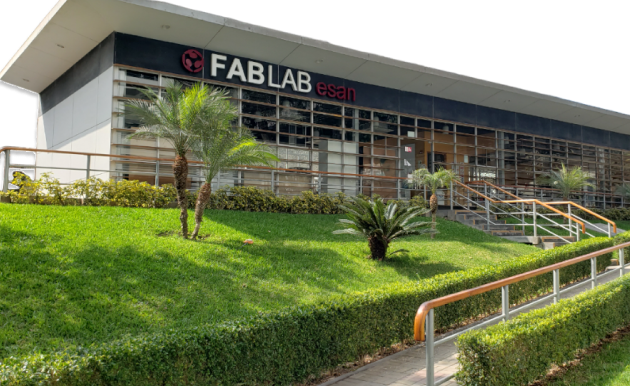

# Sobre mi

El Fab Lab ESAN es un Centro de Innovación Tecnológica autorizado por CONCYTEC especializado en modelado 3D y fabricación digital.   Estamos integrados en la Red Global de Laboratorios Fab Lab (Fab Lab NetWork) creada por el prestigioso Centro de Bits y Átomos del Instituto Tecnológico de Massachusetts (MIT) y actualmente coordinada por The Fab Foundation. Test.

**[Enlace](https://fablab.esan.edu.pe/)**
